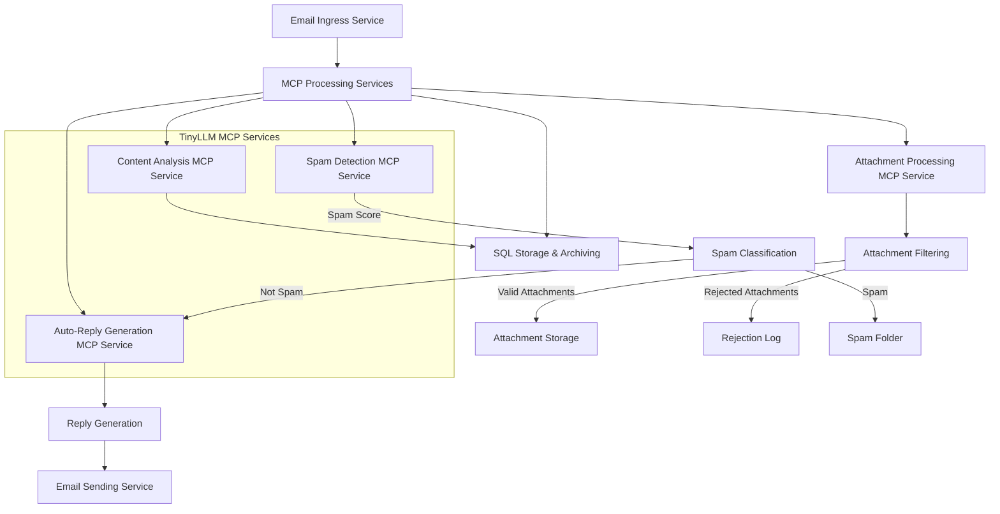

# Email Processing Flow with MCP and TinyLLM

## ASCII Diagram

```
+----------------+     +----------------+     +----------------+
|                |     |                |     |                |
|  Email Ingress | --> | MCP Processing | --> | SQL Storage    |
|  Service       |     | Services       |     | & Archiving    |
|                |     |                |     |                |
+----------------+     +----------------+     +----------------+
                              |
                              | Parallel Processing
                              v
+----------------+     +----------------+     +----------------+
|                |     |                |     |                |
| Spam Detection | <-- | Attachment    | --> | Auto-Reply     |
| MCP Service    |     | Processing    |     | Generation     |
|                |     | MCP Service   |     | MCP Service    |
+----------------+     +----------------+     +----------------+
                              |
                              | Filtered Attachments
                              v
                       +----------------+
                       |                |
                       | Attachment     |
                       | Storage        |
                       |                |
                       +----------------+
```

## Mermaid Diagram



## Process Flow Description

1. **Email Ingress**: Incoming emails are received and parsed
2. **MCP Processing**: Multiple MCP services process the email in parallel:
   - **Spam Detection**: Evaluates if the email is spam
   - **Attachment Processing**: Filters and processes attachments
   - **Content Analysis**: Analyzes email content for sentiment, urgency, etc.
   - **Auto-Reply Generation**: Creates appropriate responses
3. **Attachment Filtering**:
   - Rejects attachments > 10MB
   - Blocks specific extensions (.tar, .doc, etc.)
   - Scans for malware/suspicious content
4. **SQL Storage**: Emails and metadata are stored in SQL database
5. **Auto-Reply**: Generated responses are sent back to the sender
