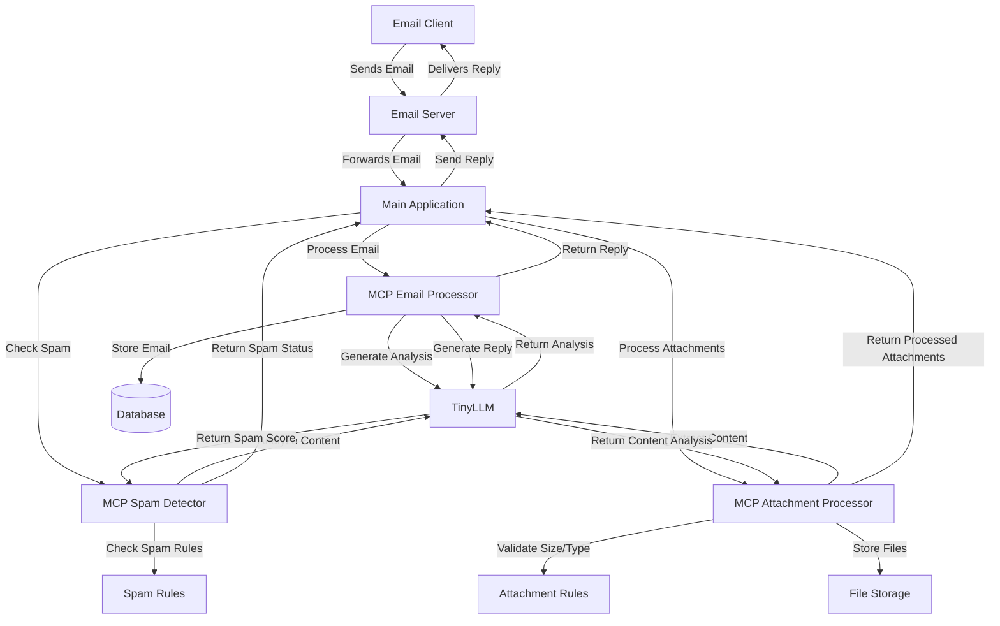

# MCP Architecture for Fin Officer Email Processing

## Overview

This document outlines the Model Context Protocol (MCP) architecture implemented for the Fin Officer email processing system. The architecture consists of multiple MCP servers working together to provide email analysis, spam detection, attachment processing, and auto-reply generation using TinyLLM.

## Architecture Diagram



## Component Description

### MCP Email Processor

The Email Processor is responsible for analyzing incoming emails, generating appropriate auto-replies, and storing emails in the database. It uses TinyLLM to understand email content and generate personalized responses.

**Key Tools:**
- `analyze_email`: Analyzes email content for tone, urgency, and categorization
- `store_email`: Stores email data in the SQL database
- `generate_auto_reply`: Creates personalized replies based on email content and templates
- `store_reply`: Records generated replies in the database

### MCP Spam Detector

The Spam Detector evaluates incoming emails to determine if they are legitimate or spam. It uses a combination of rule-based filtering and TinyLLM analysis to make this determination.

**Key Tools:**
- `detect_spam`: Analyzes email content and metadata for spam indicators
- `check_sender`: Validates sender against whitelist and reputation databases
- `analyze_links`: Examines links in emails for suspicious patterns

### MCP Attachment Processor

The Attachment Processor handles email attachments, validating their size and type, scanning for potential threats, and extracting text content when possible.

**Key Tools:**
- `validate_attachment`: Checks attachment size and file type against security rules
- `scan_attachment`: Performs basic security scanning on attachments
- `extract_text`: Extracts text content from supported file types for analysis
- `store_attachment`: Saves attachments to the file system with appropriate metadata

## Data Flow

1. **Email Reception**: The main application receives an email from the email server.
2. **Spam Check**: The email is sent to the Spam Detector for evaluation.
3. **Attachment Processing**: If the email contains attachments, they are sent to the Attachment Processor.
4. **Email Analysis**: The Email Processor analyzes the email content using TinyLLM.
5. **Reply Generation**: Based on the analysis, an appropriate auto-reply is generated.
6. **Storage**: The email, attachments, and reply are stored in the database.
7. **Reply Sending**: The auto-reply is sent back to the sender through the email server.

## Configuration

Each MCP server is configured through environment variables, allowing for flexible deployment options. Key configuration parameters include:

- **Server Names**: Unique identifiers for each MCP server
- **Transport Methods**: Communication protocols (HTTP, WebSockets, etc.)
- **Mount Paths**: URL paths for accessing MCP servers
- **Security Rules**: Attachment size limits, blocked extensions, etc.
- **LLM Settings**: Model selection, API endpoints, etc.

## Deployment

The MCP servers are deployed as Docker containers, with each server running in its own container. This allows for independent scaling and management of each component. The containers communicate with each other through a shared Docker network.

```
+-------------------+    +-------------------+    +-------------------+
|                   |    |                   |    |                   |
| Email Processor   |    | Spam Detector     |    | Attachment       |
| Container         |    | Container         |    | Processor        |
|                   |    |                   |    | Container        |
+-------------------+    +-------------------+    +-------------------+
         |                        |                        |
         |                        |                        |
         v                        v                        v
+-------------------------------------------------------------------+
|                                                                   |
|                        Docker Network                             |
|                                                                   |
+-------------------------------------------------------------------+
         ^                        ^                        ^
         |                        |                        |
         |                        |                        |
+-------------------+    +-------------------+    +-------------------+
|                   |    |                   |    |                   |
| Main Application  |    | TinyLLM           |    | Database          |
| Container         |    | Container         |    | Container        |
|                   |    |                   |    |                   |
+-------------------+    +-------------------+    +-------------------+
```

## Testing

The MCP integration is tested using Ansible playbooks that verify the functionality of each component and their interactions. The tests cover:

- Email analysis and categorization
- Spam detection accuracy
- Attachment validation and processing
- Auto-reply generation and personalization
- Database storage and retrieval

See `ansible/mcp_tests.yml` for detailed test scenarios.
